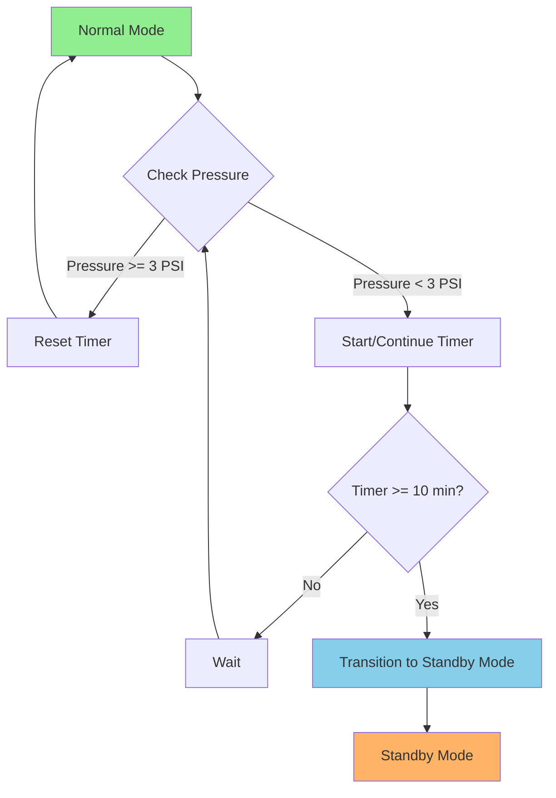

# Normal Mode to Standby Mode Flowchart

## Transition Condition
- **Trigger**: Pressure < 3 PSI for 10 minutes continuously

## State Description

| State | Description |
|-------|-------------|
| Normal Mode | System operating under normal conditions |
| Standby Mode | Low-power state when pressure drops below threshold |

## Transition Logic

1. **Monitor**: Continuously check pressure sensor
2. **Condition**: If Pressure < 3 PSI, start timer
3. **Duration**: Maintain low pressure for 10 continuous minutes
4. **Reset**: If pressure rises >= 3 PSI, reset timer
5. **Transition**: After 10 min of low pressure, enter Standby Mode
